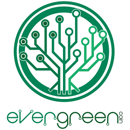

EverGreenCoin version 1.8.1.0

Cryptocurrency meets environment. 

EverGreenCoin (EGC) is a currency designed from the ground up not only to be an environmentally friendly currency but, an environmental movement and paradigm shift. With both the electrically and computationally efficient and secure algorithm of X15 Proof of Work and the generously rewarding 7% Proof of Stake the foundation has been set. On top of that foundation, we leverage renewable energy in ways our planet has never seen. EverGreenCoin is turning the mining and cryptocurrency industry on its head. From an industry that wastes electricity in the grandest scale, and in-turn our planet's finite precious resources lost forever to produce that electricity, to a profitable and prosperous endeavor for both our planet and its people. Back-feeding the grid it had once robbed. Then those profits are invested into the environment through environmental restoration projects such as forestry and wildlife rehabilitation. EverGreenCoin will make both our planet's environment and economy better than it was found.

Algorithm: X15 PoW + PoS hybrid. 
PoW length: 525960 blocks (~6 months) PoW has ended. 
PoW generated supply: 13 million EverGreenCoin. 
PoW block reward: 50 EverGreenCoin (EGC). 
1 EGC (2%) to the EGC Foundation. 49 EGC (98%) to the EGC miner(s). 
PoW block halving: none. 
Block target: 60 seconds originally. Hardforked to 180 seconds block target after block 892000.
Block maturity: 60 blocks. 
Transaction full confirmation: 7 blocks. 
PoS reward: 7% annual. 
Minimum coin age for staking: 24 hours after maturity. 
Maximum coin age for staking: none. 
P2P port: 5757 (testnet 15757). 
RPC port: 5758 (testnet 15758). 

Visit https://EverGreenCoin.org and our Bitcoin Talk thread https://bitcointalk.org/index.php?topic=2057319.0 for more details.

Copyright (C) 2015-2018 The EverGreenCoin developers. 
"EverGreenCoin" in all case variations and the EverGreenCoin logo are protected by registered international trademarks. 
All rights reserved.
